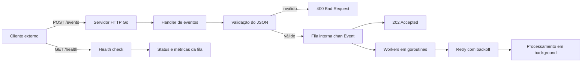

# Go Webhook Processor

Serviço HTTP em Go para recebimento e processamento assíncrono de eventos via webhook.

A aplicação foi desenhada para um cenário comum de backend: receber eventos de sistemas externos, validar o payload, responder rapidamente ao cliente e processar o trabalho em segundo plano usando uma fila interna com workers concorrentes.

## Objetivo

Este serviço resolve o problema de não bloquear requisições HTTP enquanto uma tarefa potencialmente demorada é executada. O endpoint `POST /events` apenas valida e enfileira o evento. O processamento ocorre de forma assíncrona por workers em goroutines.

Esse padrão é útil para:

- webhooks de pagamento
- integrações com ERPs e CRMs
- processamento de pedidos
- envio de notificações
- tarefas internas baseadas em eventos
- chamadas para APIs externas com maior latência

## Fluxo

```text
Cliente externo
  -> POST /events
    -> validação do JSON
      -> envio para a fila interna
        -> resposta HTTP 202 Accepted
          -> workers processam eventos em background com retry/backoff
```

## Diagrama de alto nível



Veja também a documentação detalhada em [`docs/architecture.md`](docs/architecture.md).

## Endpoints

### GET /health

Retorna o status da aplicação e informações básicas da fila interna.

Exemplo de resposta:

```json
{
  "status": "ok",
  "time": "2026-09-14T22:30:00-03:00",
  "date": "2026-09-14",
  "queueLength": 0,
  "queueCapacity": 100
}
```


### GET /metrics

Retorna um snapshot dos principais contadores operacionais da aplicação.

Exemplo de resposta:

```json
{
  "eventsQueued": 10,
  "eventsRejected": 2,
  "eventsDuplicated": 1,
  "eventsProcessed": 8,
  "eventsFailedPermanent": 1,
  "eventRetries": 3,
  "queueLength": 1,
  "queueCapacity": 100
}
```

### GET /dead-letters

Retorna os eventos que falharam permanentemente após esgotar as tentativas de retry.

Exemplo de resposta:

```json
{
  "count": 1,
  "items": [
    {
      "event": {
        "id": "evt-fail-001",
        "type": "payment.created",
        "payload": {
          "simulateFailure": true
        }
      },
      "error": "simulated processing failure",
      "attempts": 4,
      "failedAt": "2026-09-15T01:00:00Z"
    }
  ]
}
```
### POST /events

Recebe um evento para processamento assíncrono.

Payload esperado:

```json
{
  "id": "evt-001",
  "type": "payment.created",
  "payload": {
    "amount": 100
  }
}
```

Resposta de sucesso:

```json
{
  "accepted": true,
  "eventId": "evt-001"
}
```

Possíveis respostas:

```text
202 Accepted            evento validado e enfileirado
400 Bad Request         JSON inválido ou campos obrigatórios ausentes
503 Service Unavailable fila interna cheia
409 Conflict            event.id duplicado
```

## Arquitetura

```text
main.go        bootstrap, servidor HTTP e encerramento gracioso
config.go      leitura e validação de configurações por ambiente
logger.go      configuração de logs estruturados com slog
app.go         estado da aplicação, fila interna e registro das rotas
models.go      contratos de entrada e saída usados pela API
metrics.go     contadores thread-safe e snapshot de métricas
dedup.go       controle de idempotência em memória por event.id
deadletter.go  armazenamento em memória dos eventos com falha permanente
handlers.go    handlers HTTP, validação, métricas e respostas JSON
worker.go      workers, retry e backoff do processamento assíncrono
main_test.go   testes automatizados dos handlers e configurações
worker_test.go testes automatizados do retry/backoff
.env.example   exemplo de variáveis de ambiente
Dockerfile     build de imagem containerizada
.dockerignore  exclusões do contexto de build Docker
requests.http  chamadas HTTP para testar pela IDE
```

## Configuração

A aplicação pode ser configurada por variáveis de ambiente. Quando uma variável não é informada, o serviço usa um valor padrão seguro para execução local.

```text
PORT=8080
QUEUE_SIZE=100
WORKER_COUNT=3
READ_HEADER_TIMEOUT_SECONDS=5
SHUTDOWN_TIMEOUT_SECONDS=10
LOG_FORMAT=json
MAX_RETRIES=3
RETRY_BACKOFF_SECONDS=1
DEAD_LETTER_CAPACITY=100
EVENT_DEDUP_CAPACITY=1000
```

Descrição das variáveis:

```text
PORT                          porta HTTP usada pelo servidor
QUEUE_SIZE                    quantidade máxima de eventos aguardando na fila interna
WORKER_COUNT                  quantidade de workers processando eventos em paralelo
READ_HEADER_TIMEOUT_SECONDS   timeout para leitura dos headers HTTP
SHUTDOWN_TIMEOUT_SECONDS      tempo máximo para encerramento gracioso do servidor HTTP
LOG_FORMAT                    formato dos logs: json ou text
MAX_RETRIES                   quantidade de novas tentativas após a primeira falha
RETRY_BACKOFF_SECONDS         base em segundos para o backoff entre tentativas
DEAD_LETTER_CAPACITY          quantidade máxima de eventos mantidos na dead-letter queue
EVENT_DEDUP_CAPACITY          quantidade máxima de event.id mantidos para deduplicação
```

Exemplo no PowerShell:

```powershell
$env:PORT = "9090"
$env:WORKER_COUNT = "5"
go run .
```

O arquivo `.env.example` documenta os valores esperados, mas a aplicação não carrega arquivos `.env` automaticamente.

Para produção, use `LOG_FORMAT=json`. Para leitura local no terminal, `LOG_FORMAT=text` pode ser mais confortável.


## Idempotência

O endpoint `POST /events` usa o campo `id` como chave de idempotência.

Se o mesmo `event.id` for recebido novamente, a aplicação rejeita o evento com:

```text
409 Conflict
```

Isso evita processamento duplicado em cenários comuns de webhook, nos quais o sistema externo pode reenviar o mesmo evento por timeout, falha de rede ou política própria de retry.

A memória de deduplicação é limitada por `EVENT_DEDUP_CAPACITY`. Quando a capacidade é atingida, o ID mais antigo é descartado para abrir espaço para novos IDs.

Nesta versão, a deduplicação ainda é em memória. Em produção real, o próximo passo seria persistir as chaves de idempotência em banco, cache distribuído ou storage transacional.
## Concorrência

A aplicação usa uma fila interna baseada em `chan Event`:

```go
eventQueue chan Event
```

Os workers são iniciados como goroutines:

```go
go worker(workerID, eventQueue, workers, config)
```

A quantidade de workers e a capacidade da fila são configuradas por `WORKER_COUNT` e `QUEUE_SIZE`.

## Retry com backoff

Quando o processamento de um evento falha, o worker tenta processá-lo novamente antes de desistir definitivamente.

Com os valores padrão:

```text
MAX_RETRIES=3
RETRY_BACKOFF_SECONDS=1
DEAD_LETTER_CAPACITY=100
EVENT_DEDUP_CAPACITY=1000
```

Um evento pode ter até 4 tentativas no total:

```text
1 tentativa inicial + 3 retries
```

O backoff cresce de forma linear por tentativa:

```text
1ª falha -> aguarda 1 segundo
2ª falha -> aguarda 2 segundos
3ª falha -> aguarda 3 segundos
```

Se todas as tentativas falharem, o evento é registrado como falha permanente nos logs. Nesta versão, ainda não existe dead-letter queue; esse é um próximo passo natural antes de produção real.


## Dead-letter queue

Quando um evento falha permanentemente após todos os retries, ele é armazenado em uma dead-letter queue em memória.

Essa fila permite investigar falhas sem depender apenas dos logs. Cada item registra:

- evento original
- mensagem de erro
- quantidade de tentativas
- data/hora da falha

A capacidade é controlada por `DEAD_LETTER_CAPACITY`. Quando a capacidade é atingida, o item mais antigo é descartado para abrir espaço para o novo.

Nesta versão, a dead-letter queue ainda é em memória. Em produção real, o próximo passo seria persistir esses eventos em banco, fila externa ou storage dedicado.
## Encerramento gracioso

A aplicação escuta sinais de interrupção do sistema, como `Ctrl+C` no terminal ou `SIGTERM` em ambientes de orquestração.

Ao receber o sinal, o serviço:

- para de aceitar novas requisições HTTP
- aguarda o servidor HTTP encerrar dentro do timeout configurado
- fecha a fila interna de eventos
- espera os workers terminarem os eventos já retirados da fila
- registra `shutdown complete` ao final do processo

Isso evita encerrar o processo de forma abrupta enquanto eventos ainda estão em processamento.

## Requisitos

- Go 1.27+
- Docker, opcional para execução containerizada

## Execução local

```powershell
go run .
```

Se o Go ainda não estiver no PATH da sessão atual:

```powershell
& "C:\Program Files\Go\bin\go.exe" run .
```

A aplicação sobe por padrão em:

```text
http://localhost:8080
```

Para encerrar localmente, pressione `Ctrl+C` no terminal em que o serviço está rodando.

## Docker

Build da imagem:

```powershell
docker build -t go-webhook-processor:local .
```

Executar o container:

```powershell
docker run --rm `
  -p 8080:8080 `
  -e PORT=8080 `
  -e LOG_FORMAT=json `
  --name go-webhook-processor `
  go-webhook-processor:local
```

Executar com configuração customizada:

```powershell
docker run --rm `
  -p 9090:9090 `
  -e PORT=9090 `
  -e WORKER_COUNT=5 `
  -e QUEUE_SIZE=500 `
  -e LOG_FORMAT=json `
  --name go-webhook-processor `
  go-webhook-processor:local
```

## Testes

```powershell
go test ./...
```

Se o Go ainda não estiver no PATH da sessão atual:

```powershell
& "C:\Program Files\Go\bin\go.exe" test ./...
```

## Build

```powershell
go build .
```

O comando gera um binário executável do serviço.

## Testes pela IDE

O arquivo [`requests.http`](requests.http) contém chamadas prontas para uso com a extensão REST Client do VS Code.

## Testes manuais

Health check:

```powershell
Invoke-RestMethod http://localhost:8080/health
```

Enviar evento:

```powershell
Invoke-RestMethod `
  -Method Post `
  -Uri http://localhost:8080/events `
  -ContentType "application/json" `
  -Body '{"id":"evt-001","type":"payment.created","payload":{"amount":100}}'
```

Enviar múltiplos eventos ajuda a observar os workers processando em paralelo pelos logs da aplicação.

Simular falha de processamento para observar retries:

```powershell
Invoke-RestMethod `
  -Method Post `
  -Uri http://localhost:8080/events `
  -ContentType "application/json" `
  -Body '{"id":"evt-fail-001","type":"payment.created","payload":{"simulateFailure":true}}'
```

## Observabilidade atual

A aplicação registra logs estruturados no console para os principais eventos operacionais:

```text
event queued
event processing started
event processing finished
event processing failed; retrying
event processing failed permanently
worker stopped
shutdown complete
```

Os logs incluem campos como `event_id`, `event_type`, `worker_id`, `queue_length`, `queue_capacity`, `attempt`, `backoff` e `error`, facilitando busca e análise em ferramentas de observabilidade.

O endpoint `/health` expõe o estado básico da aplicação, e o endpoint `/metrics` expõe contadores como `eventsQueued`, `eventsRejected`, `eventsDuplicated`, `eventsProcessed`, `eventsFailedPermanent` e `eventRetries`.

## Limitações atuais

Esta versão ainda usa fila em memória. Isso significa que eventos pendentes podem ser perdidos se o processo cair de forma abrupta, por exemplo em um kill forçado, falha da máquina ou reinício inesperado.

Antes de uso real em produção, os próximos passos recomendados são:

- persistir eventos em banco ou fila externa
- adicionar dead-letter queue para eventos com falha permanente
- adicionar métricas


