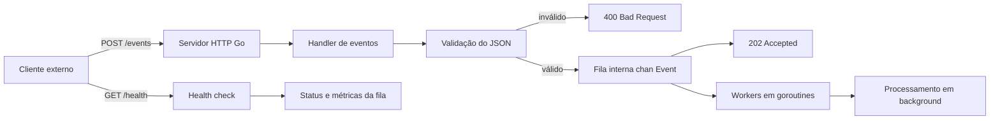

# Go Webhook Processor

Serviço HTTP em Go para recebimento e processamento assíncrono de eventos via webhook.

A aplicação foi desenhada para um cenário comum de backend: receber eventos de sistemas externos, validar o payload, responder rapidamente ao cliente e processar o trabalho em segundo plano usando uma fila interna com workers concorrentes.

## Objetivo

Este serviço resolve o problema de não bloquear requisições HTTP enquanto uma tarefa potencialmente demorada é executada. O endpoint `POST /events` apenas valida e enfileira o evento. O processamento ocorre de forma assíncrona por workers em goroutines.

Esse padrão é útil para:

- webhooks de pagamento
- integrações com ERPs e CRMs
- processamento de pedidos
- envio de notificações
- tarefas internas baseadas em eventos
- chamadas para APIs externas com maior latência

## Fluxo

```text
Cliente externo
  -> POST /events
    -> validação do JSON
      -> envio para a fila interna
        -> resposta HTTP 202 Accepted
          -> workers processam eventos em background
```


## Diagrama de alto nível



Veja também a documentação detalhada em [`docs/architecture.md`](docs/architecture.md).
## Endpoints

### GET /health

Retorna o status da aplicação e informações básicas da fila interna.

Exemplo de resposta:

```json
{
  "status": "ok",
  "time": "2026-09-14T22:30:00-03:00",
  "date": "2026-09-14",
  "queueLength": 0,
  "queueCapacity": 100
}
```

### POST /events

Recebe um evento para processamento assíncrono.

Payload esperado:

```json
{
  "id": "evt-001",
  "type": "payment.created",
  "payload": {
    "amount": 100
  }
}
```

Resposta de sucesso:

```json
{
  "accepted": true,
  "eventId": "evt-001"
}
```

Possíveis respostas:

```text
202 Accepted            evento validado e enfileirado
400 Bad Request         JSON inválido ou campos obrigatórios ausentes
503 Service Unavailable fila interna cheia
```

## Arquitetura

```text
main.go       bootstrap, servidor HTTP e encerramento gracioso
config.go     leitura e validação de configurações por ambiente
logger.go     configuração de logs estruturados com slog
app.go        estado da aplicação, fila interna e registro das rotas
models.go     contratos de entrada e saída usados pela API
handlers.go   handlers HTTP, validação e respostas JSON
worker.go     workers responsáveis pelo processamento assíncrono
main_test.go  testes automatizados dos handlers e configurações
.env.example  exemplo de variáveis de ambiente
```

## Configuração

A aplicação pode ser configurada por variáveis de ambiente. Quando uma variável não é informada, o serviço usa um valor padrão seguro para execução local.

```text
PORT=8080
QUEUE_SIZE=100
WORKER_COUNT=3
READ_HEADER_TIMEOUT_SECONDS=5
SHUTDOWN_TIMEOUT_SECONDS=10
LOG_FORMAT=json
```

Descrição das variáveis:

```text
PORT                          porta HTTP usada pelo servidor
QUEUE_SIZE                    quantidade máxima de eventos aguardando na fila interna
WORKER_COUNT                  quantidade de workers processando eventos em paralelo
READ_HEADER_TIMEOUT_SECONDS   timeout para leitura dos headers HTTP
SHUTDOWN_TIMEOUT_SECONDS      tempo máximo para encerramento gracioso do servidor HTTP
LOG_FORMAT                    formato dos logs: json ou text
```

Exemplo no PowerShell:

```powershell
$env:PORT = "9090"
$env:WORKER_COUNT = "5"
go run .
```

O arquivo `.env.example` documenta os valores esperados, mas a aplicação não carrega arquivos `.env` automaticamente.

Para produção, use `LOG_FORMAT=json`. Para leitura local no terminal, `LOG_FORMAT=text` pode ser mais confortável.

## Concorrência

A aplicação usa uma fila interna baseada em `chan Event`:

```go
eventQueue chan Event
```

Os workers são iniciados como goroutines:

```go
go worker(workerID, eventQueue, workers)
```

A quantidade de workers e a capacidade da fila são configuradas por `WORKER_COUNT` e `QUEUE_SIZE`.

## Encerramento gracioso

A aplicação escuta sinais de interrupção do sistema, como `Ctrl+C` no terminal ou `SIGTERM` em ambientes de orquestração.

Ao receber o sinal, o serviço:

- para de aceitar novas requisições HTTP
- aguarda o servidor HTTP encerrar dentro do timeout configurado
- fecha a fila interna de eventos
- espera os workers terminarem os eventos já retirados da fila
- registra `shutdown complete` ao final do processo

Isso evita encerrar o processo de forma abrupta enquanto eventos ainda estão em processamento.

## Requisitos

- Go 1.27+

## Execução local

```powershell
go run .
```

Se o Go ainda não estiver no PATH da sessão atual:

```powershell
& "C:\Program Files\Go\bin\go.exe" run .
```

A aplicação sobe por padrão em:

```text
http://localhost:8080
```

Para encerrar localmente, pressione `Ctrl+C` no terminal em que o serviço está rodando.

## Testes

```powershell
go test ./...
```

Se o Go ainda não estiver no PATH da sessão atual:

```powershell
& "C:\Program Files\Go\bin\go.exe" test ./...
```

## Build

```powershell
go build .
```

O comando gera um binário executável do serviço.

## Testes manuais

Health check:

```powershell
Invoke-RestMethod http://localhost:8080/health
```

Enviar evento:

```powershell
Invoke-RestMethod `
  -Method Post `
  -Uri http://localhost:8080/events `
  -ContentType "application/json" `
  -Body '{"id":"evt-001","type":"payment.created","payload":{"amount":100}}'
```

Enviar múltiplos eventos ajuda a observar os workers processando em paralelo pelos logs da aplicação.

## Observabilidade atual

A aplicação registra logs estruturados no console para os principais eventos operacionais:

```text
event queued
worker processing event
worker finished event
worker stopped
shutdown complete
```

Os logs incluem campos como `event_id`, `event_type`, `worker_id`, `queue_length`, `queue_capacity` e `error`, facilitando busca e análise em ferramentas de observabilidade.

O endpoint `/health` também expõe o tamanho atual da fila por meio dos campos `queueLength` e `queueCapacity`.

## Limitações atuais

Esta versão ainda usa fila em memória. Isso significa que eventos pendentes podem ser perdidos se o processo cair de forma abrupta, por exemplo em um kill forçado, falha da máquina ou reinício inesperado.

Antes de uso real em produção, os próximos passos recomendados são:

- persistir eventos em banco ou fila externa
- adicionar logs estruturados
- adicionar métricas
- adicionar retry com backoff
- adicionar Dockerfile


