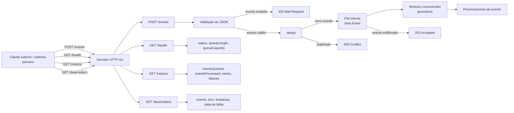
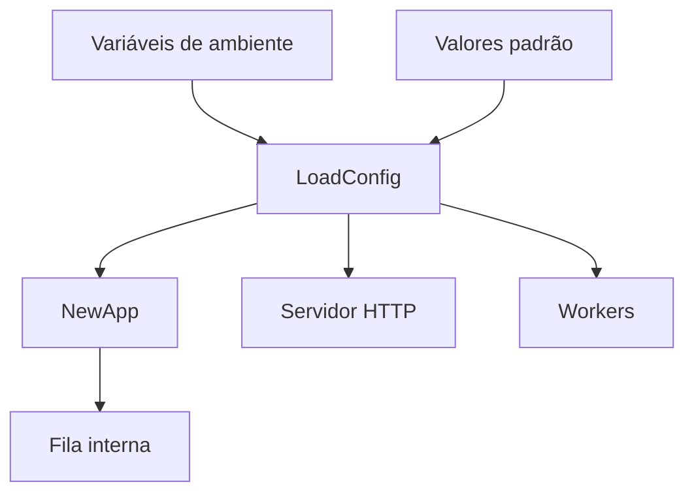
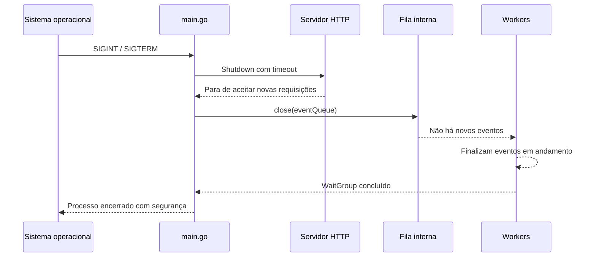

# Arquitetura de Alto Nível

Este documento descreve o fluxo atual do Go Webhook Processor.

## Fluxo principal



## Fluxo de configuração



## Fluxo de encerramento gracioso



## Explicação rápida

1. Um sistema externo envia `POST /events`.
2. O handler valida o JSON e os campos obrigatórios.
3. Se o evento for válido, a aplicação verifica se o `event.id` já foi recebido.
4. Eventos duplicados recebem `409 Conflict` e não entram na fila.
5. Eventos novos entram na fila interna `chan Event`.
6. A API responde `202 Accepted` rapidamente.
7. Os workers, rodando em goroutines, consomem a fila e processam os eventos em paralelo.
8. Se o processamento falhar, o worker aplica retry com backoff antes de registrar falha permanente.
9. Eventos com falha permanente entram na dead-letter queue em memória para investigação.
10. A aplicação atualiza métricas em memória para eventos enfileirados, rejeitados, processados, retentados e com falha permanente.
11. A aplicação registra logs estruturados com campos como `event_id`, `event_type` e `worker_id`.
12. O endpoint `GET /health` mostra o estado básico da aplicação e da fila.
13. Quando a aplicação recebe `Ctrl+C` ou `SIGTERM`, ela executa shutdown gracioso.

## Componentes atuais

```text
Cliente externo -> HTTP server -> handler -> validação -> deduplicação -> fila interna -> workers -> retry/backoff -> processamento
```

A fila ainda é em memória. Em uma evolução futura, ela pode ser substituída ou complementada por uma fila externa, como RabbitMQ, Kafka, SQS ou Redis Streams.


