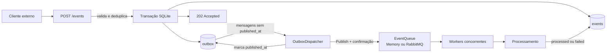
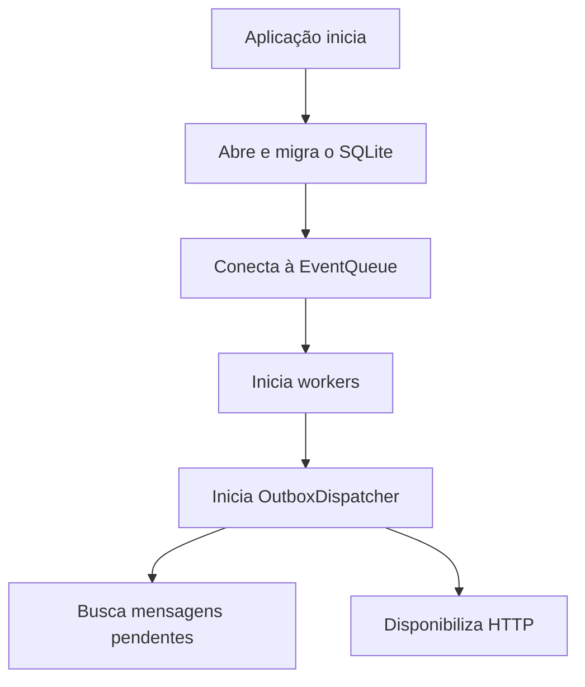
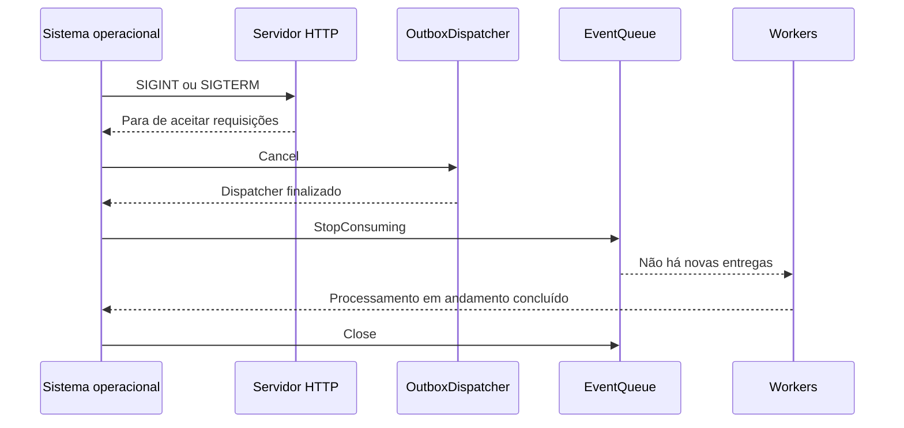

# Arquitetura de Alto Nível

Este documento descreve o fluxo atual do Go Webhook Processor com Transactional Outbox.

## Fluxo principal



## Garantia transacional

O registro em `events` e a mensagem em `outbox` são inseridos na mesma transação SQLite. Ou ambos são confirmados, ou nenhum deles é persistido. Assim, uma falha entre o banco e o RabbitMQ não perde a intenção de publicação.

O dispatcher executa continuamente:

1. Busca um lote de mensagens com `published_at IS NULL`.
2. Publica cada evento pela interface `EventPublisher`.
3. Aguarda a confirmação do provider.
4. Marca a mensagem como publicada.
5. Em caso de falha, incrementa `attempts`, registra `last_error` e tenta novamente em outro ciclo.

## Semântica de entrega

A garantia é `at-least-once`. Se o processo cair depois de o broker confirmar a publicação e antes de o SQLite gravar `published_at`, a mensagem continuará pendente e poderá ser publicada novamente. Por isso, consumidores precisam tratar `event.id` de forma idempotente.

A implementação atual possui um dispatcher por instância. Para executar várias réplicas simultâneas, uma evolução deverá adicionar reivindicação de mensagens ou locking apropriado ao banco usado em produção.

## Inicialização



A migração cria a tabela `outbox` e também gera mensagens para eventos antigos que ainda estejam com status `queued`.

## Encerramento gracioso



## Componentes

```text
Cliente -> HTTP -> SQLite (events + outbox) -> dispatcher -> EventQueue -> workers -> processamento
```

- `handlers.go`: valida e persiste a transação.
- `event_store.go`: mantém eventos e mensagens Outbox.
- `outbox.go`: publica mensagens pendentes.
- `queue.go`: define contratos independentes do provider.
- `rabbitmq_queue.go`: implementa publicação confirmada e consumo com ACK manual.

## Reconexão RabbitMQ

O publisher cria uma conexão sob demanda e a invalida quando uma publicação ou confirmação falha. A tentativa seguinte cria uma nova sessão. O consumer mantém um loop próprio: quando a conexão fecha inesperadamente, aguarda `RABBITMQ_RECONNECT_MS` e conecta novamente. A inicialização da aplicação não exige que o broker já esteja disponível; o Outbox mantém as mensagens pendentes durante a indisponibilidade.
- `worker.go`: processa eventos, aplica retry e atualiza o status.
