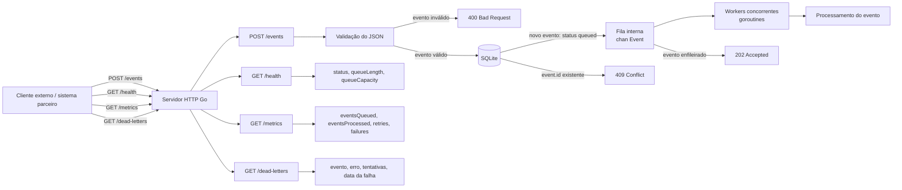
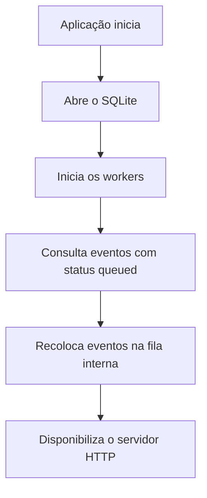
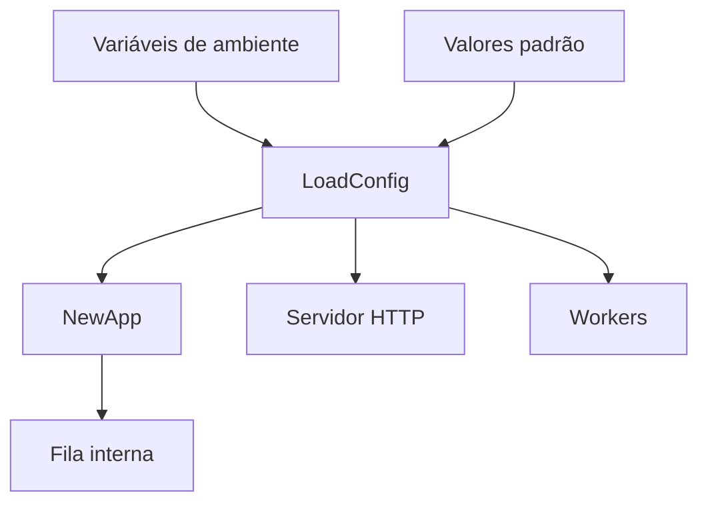
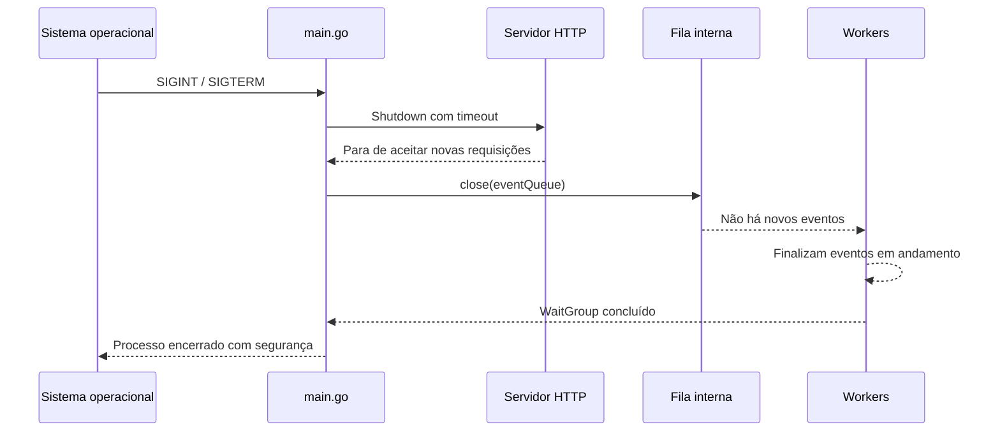

# Arquitetura de Alto Nível

Este documento descreve o fluxo atual do Go Webhook Processor.

## Fluxo principal



## Fluxo de inicialização e recuperação


## Fluxo de configuração



## Fluxo de encerramento gracioso



## Explicação rápida

1. Um sistema externo envia `POST /events`.
2. O handler valida o JSON e os campos obrigatórios.
3. Se o evento for válido, a aplicação tenta persistir o `event.id` no SQLite.
4. A chave primária do banco rejeita IDs já existentes; eventos duplicados recebem `409 Conflict` e não entram na fila.
5. Eventos novos são persistidos no SQLite com status `queued`.
6. Depois de persistidos, entram na fila interna `chan Event`.
7. A API responde `202 Accepted` rapidamente.
8. Os workers, rodando em goroutines, consomem a fila e processam os eventos em paralelo.
9. Se o processamento falhar, o worker aplica retry com backoff antes de registrar falha permanente.
10. Eventos com falha permanente entram na dead-letter queue em memória para investigação.
11. A aplicação atualiza métricas em memória para eventos enfileirados, rejeitados, processados, retentados e com falha permanente.
12. A aplicação registra logs estruturados com campos como `event_id`, `event_type` e `worker_id`.
13. O endpoint `GET /health` mostra o estado básico da aplicação e da fila.
14. Na inicialização, eventos que permaneceram como `queued` são recuperados do SQLite antes da abertura do servidor HTTP.
15. Quando a aplicação recebe `Ctrl+C` ou `SIGTERM`, ela executa shutdown gracioso.

## Componentes atuais

```text
Cliente externo -> HTTP server -> handler -> validação -> SQLite/idempotência -> fila interna -> workers -> retry/backoff -> processamento
```

A fila ainda é em memória. Em uma evolução futura, ela pode ser substituída ou complementada por uma fila externa, como RabbitMQ, Kafka, SQS ou Redis Streams.
