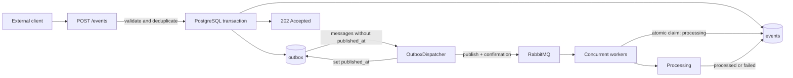
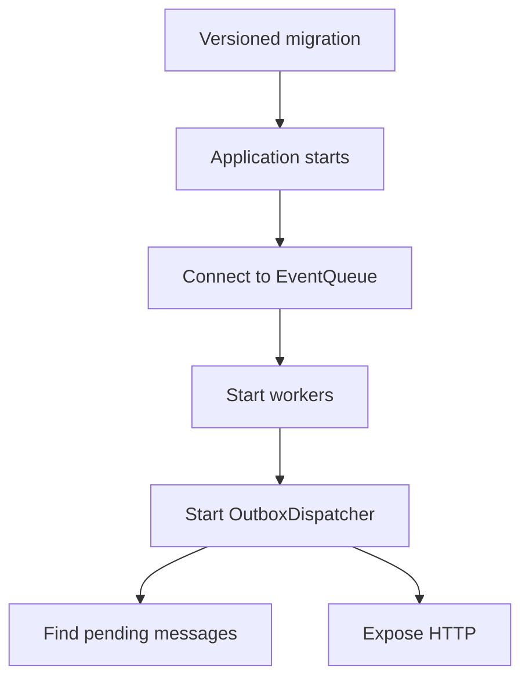
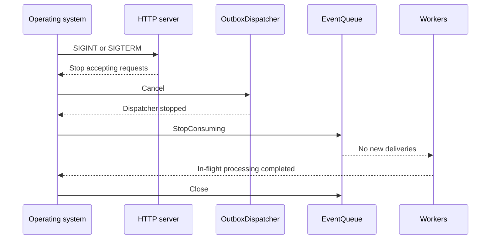

# High-Level Architecture

This document describes the current Go Webhook Processor flow with a Transactional Outbox.

## Main flow



## Transactional guarantee

The `events` record and the `outbox` message are inserted in the same PostgreSQL transaction. Both are committed, or neither is persisted. Therefore, a failure between the database and RabbitMQ does not lose the publication intent.

The dispatcher continuously:

1. Claims a batch of pending messages with `FOR UPDATE SKIP LOCKED`.
2. Publishes each event through the `EventPublisher` interface.
3. Waits for RabbitMQ confirmation.
4. Marks the message as published only while the reservation token still belongs to that dispatcher.
5. On failure, increments `attempts`, records `last_error`, and retries during a later cycle.

## Delivery semantics

The guarantee is `at-least-once`. If the process stops after the broker confirms publication but before PostgreSQL records `published_at`, the message remains pending and may be published again. Consumers must therefore process `event.id` idempotently.

Multiple replicas can run dispatchers simultaneously. Each replica claims distinct batches with `FOR UPDATE SKIP LOCKED`, a random token, and `OUTBOX_DISPATCH_LEASE_SECONDS`. If an instance stops before completing, the message becomes eligible again after the reservation expires.

## Startup



Migrations are versioned SQL files in `migrations/`, applied by the `migrate` command before the application starts. The `schema_migrations` table records the schema version so each change is applied only once.

## Graceful shutdown



## Components

```text
Client -> HTTP -> PostgreSQL (events + outbox) -> dispatcher -> RabbitMQ -> workers -> events/dead_letters
```

- `handlers.go`: validates requests and persists the transaction.
- `event_store.go`: manages events and Outbox messages.
- `outbox.go`: publishes pending messages.
- `dlq_retry.go`: schedules automatic Dead Letter retries.
- `queue.go`: defines publication, consumption, and delivery contracts.
- `rabbitmq_queue.go`: implements confirmed publishing and manual-ACK consumption.
- `worker.go`: processes events, applies retries, and updates status.

## RabbitMQ reconnection

The publisher creates a connection on demand and invalidates it when publishing or confirmation fails. The next attempt creates a new session. The consumer has its own loop: when the connection closes unexpectedly, it waits for `RABBITMQ_RECONNECT_MS` and reconnects. The application can start while the broker is unavailable; the Outbox keeps messages pending during the outage.

## Consumer idempotency

Each delivery goes through a PostgreSQL compare-and-set before the business effect:

```sql
UPDATE events
SET status = 'processing', processing_started_at = ?
WHERE id = ?
  AND (
    status = 'queued'
    OR (status = 'processing' AND processing_started_at <= ?)
  );
```

An updated row means that the worker acquired the lease. With no updated row, the worker checks the current state: final states are acknowledged without reprocessing; an active lease causes NACK with requeue; an expired lease can be recovered. `PROCESSING_LEASE_SECONDS` must be longer than the maximum expected normal processing time.

## Persistent Dead Letter Queue

When all processing attempts fail, the worker stores the event in `dead_letters` with the error, attempt count, `failed_at`, and request correlation data. `GET /dead-letters` reads PostgreSQL, so the history remains available after restarts. Manual and automatic replay use explicit policies and preserve the original DLQ record.
